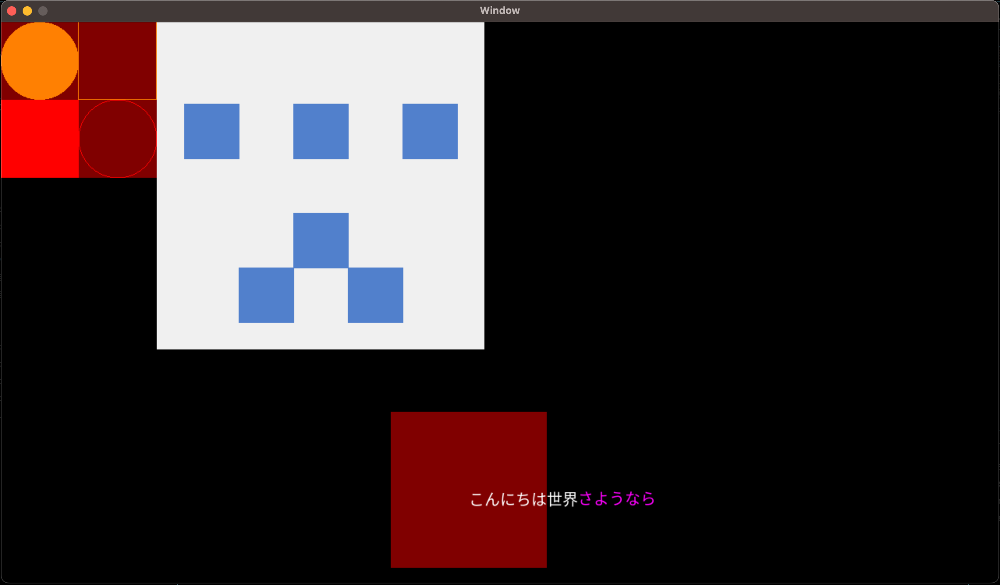

# ag
`ag` は `abstract graphics` の略です。  
複数の描画バックエンドを共通のインターフェイスで扱える様にします。  
各バックエンドの切り替えは以下の様に行います。

`OpenGL` を有効にする場合：
````
cmake . -DASSIMP_BUILD_TESTS=OFF -DASSIMP_WARNINGS_AS_ERRORS=OFF -DBUILD_SHARED_LIBS=OFF -DCMAKE_BUILD_TYPE=Debug -DAG_BACKEND="OpenGL" -G "Unix Makefiles"
````

`Metal` を有効にする場合：
````
cmake . -DASSIMP_BUILD_TESTS=OFF -DASSIMP_WARNINGS_AS_ERRORS=OFF -DBUILD_SHARED_LIBS=OFF -DCMAKE_BUILD_TYPE=Debug -DAG_BACKEND="Metal" -G "Unix Makefiles"
````

`DirectX` を有効にする場合：
````
cmake . -DASSIMP_BUILD_TESTS=OFF -DASSIMP_WARNINGS_AS_ERRORS=OFF -DBUILD_SHARED_LIBS=OFF -DCMAKE_BUILD_TYPE=Debug -DAG_BACKEND="DirectX" -G "Unix Makefiles"
````

# example
agは簡単な2D描画のサンプル
````.cpp
#include <ag/easy/App.hpp>

class MyApp : public ag::easy::App {
public:
    MyApp(int argc, char* argv[])
        : App(argc, argv)
    {
    }
    void start(const ag::Window::Instance& window, const ag::InputState& input, const ag::Renderer::Instance& renderer)
    {
        renderer->setFontMap(loadFontMap("testdata/fonts/NotoSansJP-Regular.otf"));
        loadTexture("testdata/textures/ghicon.png");
    }
    void update(const ag::Window::Instance& window, const ag::InputState& input, const ag::Renderer::Instance& renderer)
    {
        renderer->begin(window, ag::RenderPass::default2D());
        renderer->fillCircle(glm::vec2(), glm::vec2(100, 100), glm::vec4(1, 1, 0, 1));
        renderer->fillRect(glm::vec2(0, 100), glm::vec2(100, 100), glm::vec4(1, 0, 0, 1));
        renderer->drawRect(glm::vec2(100, 0), glm::vec2(100, 100), glm::vec4(1, 1, 0, 1));
        renderer->drawCircle(glm::vec2(100, 100), glm::vec2(100, 100), glm::vec4(1, 0, 0, 1));
        renderer->drawTexture(glm::vec2(200, 0), loadTexture("testdata/textures/ghicon.png"), glm::vec4(1, 1, 1, 1));
        renderer->fillRect(glm::vec2(0, 0), glm::vec2(200, 200), glm::vec4(1, 0, 0, 0.5f));
        renderer->fillRect(glm::vec2(500, 500), glm::vec2(200, 200), glm::vec4(1, 0, 0, 0.5f));

        glm::vec2 helloTextPos = glm::vec2(600, 600);
        renderer->drawString(helloTextPos, 20, u"こんにちは世界", glm::vec4(1, 1, 1, 1));
        helloTextPos.x += renderer->measureString(20, u"こんにちは世界").x;
        renderer->drawString(helloTextPos, 20, u"さようなら", glm::vec4(1, 0, 1, 1));
        renderer->end();
    }

private:
};

int main(int argc, char* argv[])
{
    MyApp app(argc, argv);
    return app.main(1280, 720, false, "SpriteDraw");
}
````

これをビルドすると以下のような結果が得られます。

